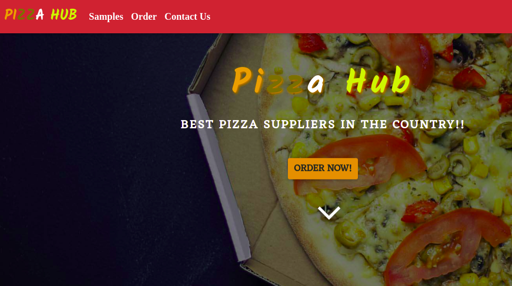

# PIZZA HUB
#### This is a project on online Pizza Shop known as Pizza-Hub.
 
 ***Tuesday September 21 2021*** 
#### By **OMOLO LEVY**&trade;

## Description
This website allows the customers to;

Choose the size of pizza they want e.g Small, Medium, Large.  Choose what kind of crust they would like the pizza to have e.g Crispy, Stuffed, Gluten-free. 
Choose the topping(s) they want on their pizza.
Place an order for their Pizza and see the total charge for it. 
Have an option to order as many pizzas as they want. 
Have an option to have the pizza delivered or not.  If delivered they want to be alerted how much the delivery charge will be. 
If they want their pizza to be delivered, they want to be prompted to enter where the delivery should be made and an alert saying "your order will be delivered to your location." 
See a checkout button that when clicked shows the total amount charged for the orders.
## Project live site
  This is the live .[ Click for the demo](https://omololevy.github.io/Pizza-Hub/)

  

## Setup instructions
* Clone the program from [Online repo](https://github.com/omololevy/Pizza-Hub)
* Click on the green button to clone or download

## Technologies Used
* HTML
* CSS
* Bootsrap
* JQuery
* Javascript

## Support and contact details
contact me @ omololevy@gmail.com
### License
The project is under [MIT license](https://github.com/Levy/Pizza-Hub/blob/master/LICENSE) 
Copyright &copy; 2021.All rigths reservedg
  